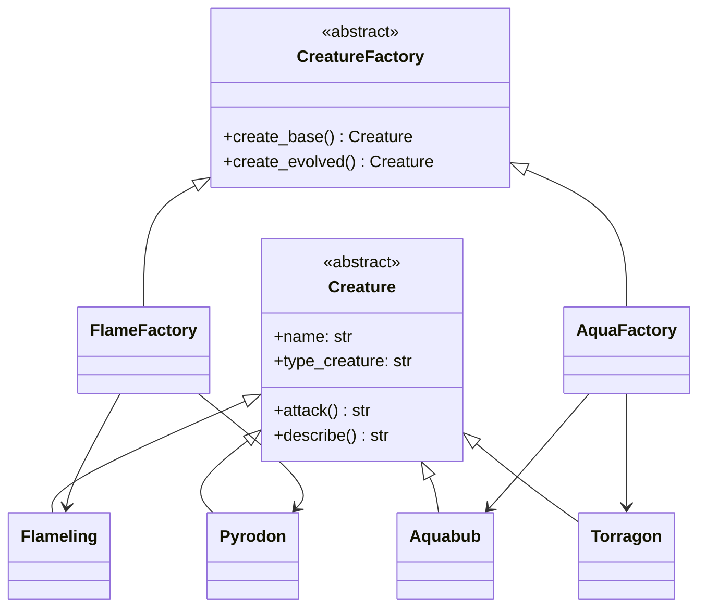
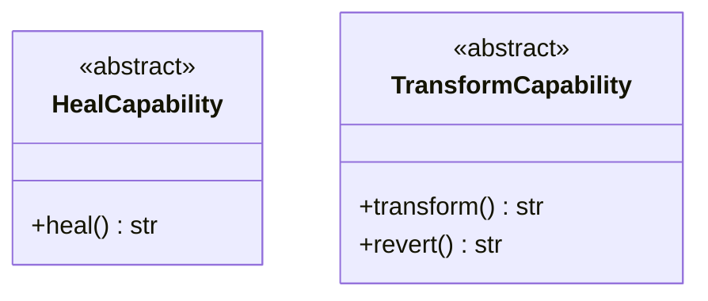
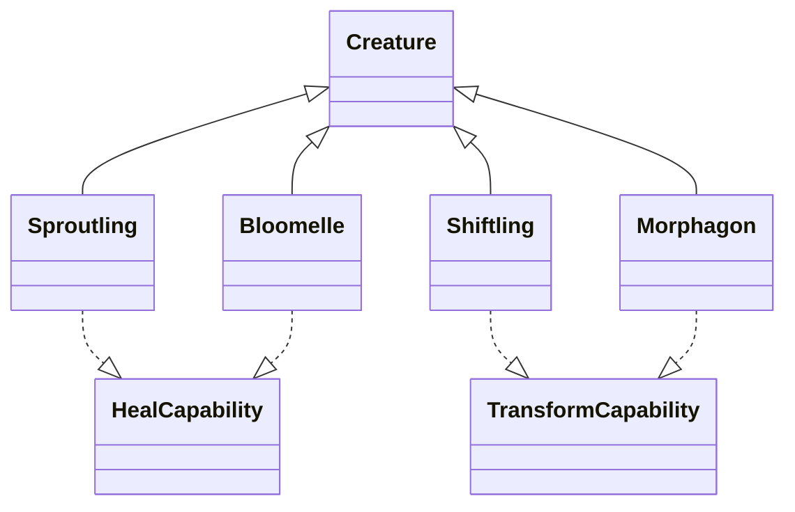
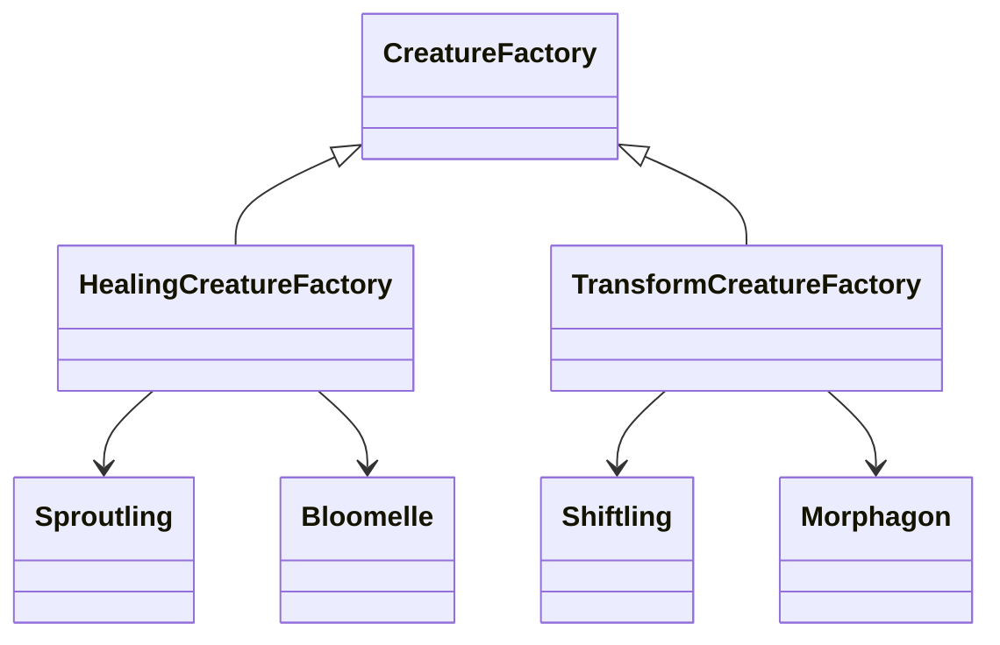
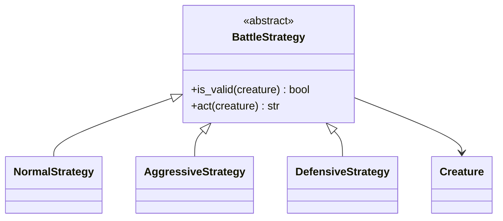
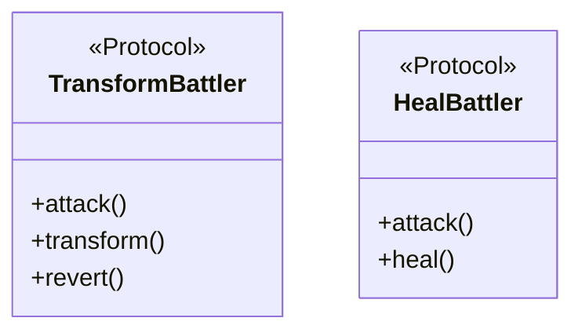
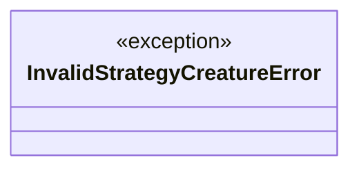
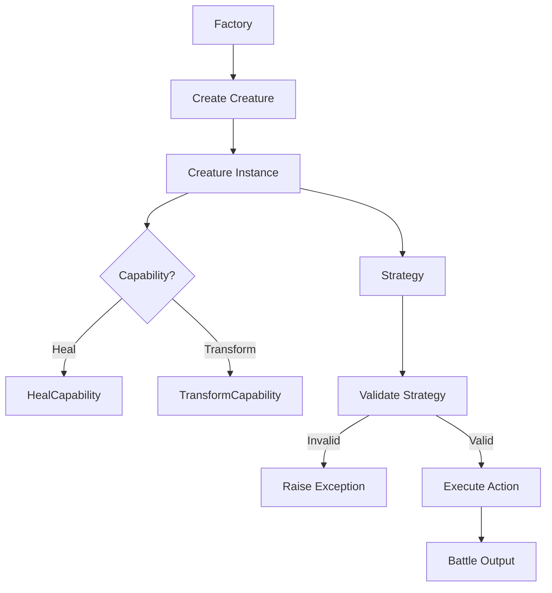

# 🐉 Creature Battle System

Sistema modular de criaturas que implementa múltiples patrones de diseño en Python:

* **Abstract Factory**
* **Strategy**
* **Composition (Capabilities)**
* **Protocols (typing estructural)**
* **Custom Exceptions**

---

# 📦 Arquitectura del proyecto

El proyecto está dividido en 3 capas principales:

```
ex0 → Core (criaturas base + factories)
ex1 → Extensiones (capabilities + nuevas factories)
ex2 → Lógica de combate (strategies + exceptions)
```

---

# 🧱 1. Core – Criaturas y Abstract Factory (ex0)

Fuente: 



✔ Cada fábrica crea una familia consistente de criaturas
✔ Separación total entre creación y uso

---

# ⚡ 2. Capabilities (ex1)

Fuente: 



✔ Añaden comportamiento sin modificar `Creature`
✔ Uso de composición en vez de herencia rígida

---

# 🌿 3. Criaturas con capacidades (ex1)

Fuente: 



✔ Extensión limpia del sistema
✔ Sin tocar el core (Open/Closed Principle)

---

# 🏭 4. Factories extendidas (ex1)

Fuente: 



---

# 🧠 5. Strategy Pattern (ex2)

Fuente: 



✔ El comportamiento se decide en runtime
✔ No se modifica la criatura

---

# 🔍 6. Protocols (tipado estructural)



✔ Permite tipado flexible sin acoplar clases
✔ Uso avanzado de typing en Python

---

# 🚨 7. Manejo de errores

Fuente: 



✔ Se lanza cuando una estrategia no es compatible
✔ Ejemplo: estrategia agresiva sin transformación

---

# 🔄 8. Flujo completo del sistema



---

# 🧪 9. Ejecución del sistema

## 🔹 Factory + Battle básico

Fuente: 

* Creación de criaturas
* Ataques básicos

---

## 🔹 Capabilities

Fuente: 

* Heal → `heal()`
* Transform → `transform()` / `revert()`

---

## 🔹 Tournament (completo)

Fuente: 

* Round-robin
* Estrategias dinámicas
* Manejo de errores

---

# 🎯 Diseño y principios aplicados

✔ Single Responsibility Principle
✔ Open/Closed Principle
✔ Low Coupling
✔ High Cohesion
✔ Composition over Inheritance

---

# 🚀 Posibles mejoras

* Sistema de stats (HP, daño, defensa)
* Sistema de tipos (ventajas/desventajas)
* Motor real de combate por turnos
* Logging en vez de prints
* Tests automatizados (pytest)

---

# 🧠 Resumen

Este proyecto demuestra:

* Diseño modular y escalable
* Uso real de patrones de diseño clásicos
* Buen manejo de tipado avanzado en Python
* Separación clara entre creación, comportamiento y ejecución

---

🔥 Proyecto ideal para portfolio técnico
